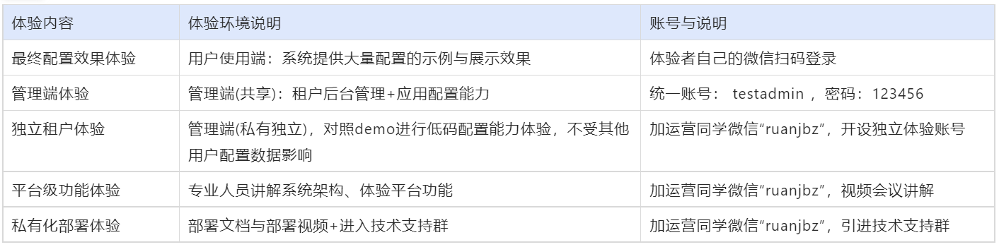
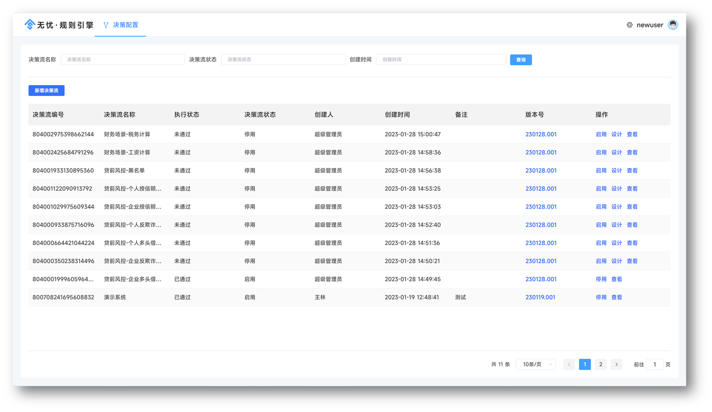
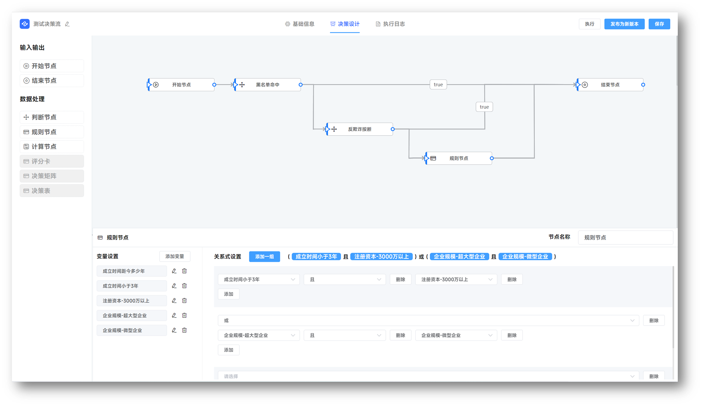
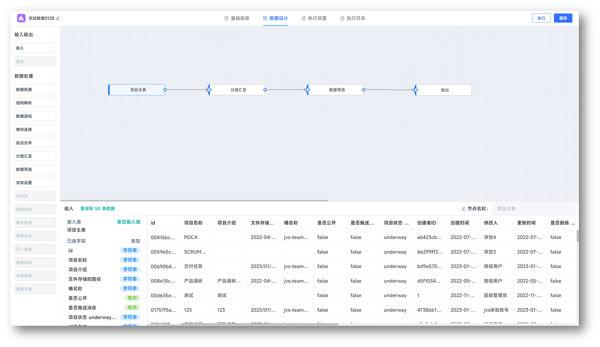
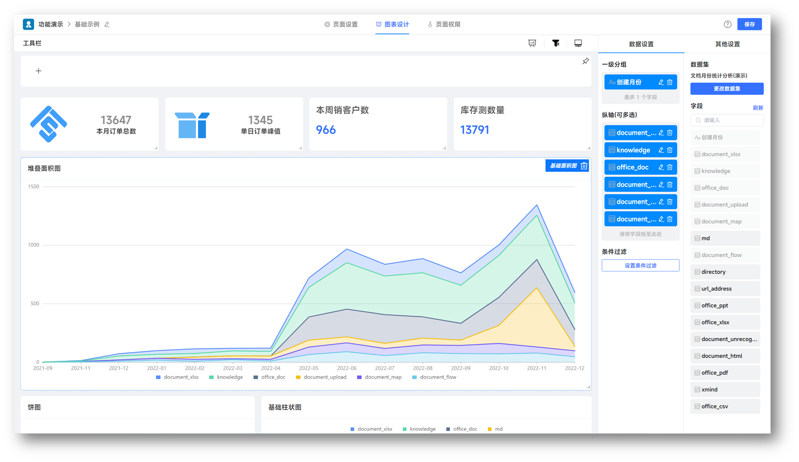

## jvs-rules（规则引擎）

### 介绍
本项目是基于JVS逻辑引擎构建的规则引擎，将JVS低代码开发平台的逻辑引擎简化，交互优化，从而形成侧重于金融风控、场景规则计算、在线决策的JVS-Rules。逻辑引擎 侧重于逻辑处理（数据加工、规则判断、业务拼装） ，规则引擎侧重于规则判断，主要用于风控决策、规则过滤、行为评分等场景，采用极简的使用门槛、不过度依赖于编程技术要求的前提下，构建支持在线的变量加工、界面拖拽、在线测试等多种功能。

### 软件技术栈
采用 JVS（spring cloud的快速应用脚手架）构架，前端VUE+ElementUI。
jvs-rules是基于JVS快速开发平台上构建的一个原生应用，整体架构体系如下。

### 项目特点

- 纯java开发，采用微服务作为基础脚手架，稳定性与通用性有保障
- 易用性，有良好的界面交互体验，采用类excel函数的使用方式，对变量加工非常简单高效
- 扩展性，基于JVS基础底座开发，可以通过低代码扩展各种信贷进件系统、信贷审批系统等等
- 持续性，后续还将增加风控报告的功能，对不同产品、不同场景，提供多种评估报告

### 账号与体验地址
体验地址与账号说明
输入图片说明 账号说明：

普通用户端：体验者自有微信扫码登录
管理端(全网共享)：testadmin 123456
管理端+应用编辑：联系运营微信号 ruanjbz，开设独立环境与独立账号
管理端+平台配置+应用编辑：联系运营微信号 ruanjbz，获取私有化部署文档与安装包

地址说明：

- 管理平台（含管理平台、低代码）：https://frame.bctools.cn/
- 数据智仓（数据分析平台）：http://bi.bctools.cn/
- 企业文档：http://knowledge.bctools.cn/
- 企业计划（项目管理）：http://teamwork.bctools.cn/
- 企业邮筒（Web邮箱客户端）：http://mailbox.bctools.cn/
- 规则引擎：http://rules.bctools.cn/
- 逻辑引擎：http://logic.bctools.cn/
- 视频会议：http://meeting.bctools.cn/
- APS（智能排产）：https://aps.bctools.cn/
  

#### 场景示例

1.  风控场景，
2.  计息场景
3.  营销场景

### 部分界面截图

自动化决策管理：

决策流程配置：

变量公式加工设计

多种业务场景

### 能力扩展

1.多种数据变量的风控报告（灵活在线自定义，基于word在线编辑的报告模板，0使用门槛）

2.联动基于JVS快速开发套件配置的进件系统（完成业务逻辑与业务全流程配置化）

3.联动JVS数据智仓，完成在线数据的分析加工处理（0门槛实现数据分析统计）

#### 项目使用说明
本项目仅仅用于个人学习，未经授权的情况下不得用于商业项目，如果商业授权、二次开发等方面的支持，请加微信 ruanjbz

### 技术交流与商务支持

如因人数限制无法加群时，可加运营同学拉入技术交流群

